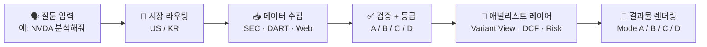

<div align="center">

# Stock Analysis Agent

### 미국·한국 주식을 위한 기관급 리서치 엔진 — 지어낸 숫자 없이.

**Claude Code**가 바이사이드 파이프라인을 그대로 돌립니다. SEC·DART 원본 우선, 모든 수치에 출처 태그, 셀마다 신뢰도 등급. 티커 하나로 메모까지 몇 분.

<sub>[English](README.md) · **한국어**</sub>

<br/>


<br/>

<a href="https://codepen.io/lowtidebuild/full/RNGKxVx"></a>
<a href="https://codepen.io/lowtidebuild/full/azmpmGJ"></a>
<a href="https://codepen.io/lowtidebuild/full/azmpbNx"></a>
<a href="https://docs.google.com/document/d/1md5xHBSE71kRkinSsn2sqPQlc91QaYxo/edit?usp=sharing&ouid=105178834220477378953&rtpof=true&sd=true"></a>

<br/><br/>


</div>

---

## 왜 만들었나

대부분의 주식 리서치 챗봇은 P/E를 지어내고, 매출을 환각하고, 실제로는 그런 내용이 없는 출처를 태연히 인용합니다. 이 에이전트는 정확히 그 반대 전제 위에 서 있습니다.

> **빈칸 > 틀린 숫자.** 1차 출처로 검증되지 않은 수치는 `—`로 남깁니다. 예외 없습니다.

시스템을 지탱하는 5가지 원칙:

| | 원칙 | 실제로 의미하는 것 |
|---|---|---|
| **1** | **빈칸 > 틀린 숫자** | Grade D는 `—`로 렌더링. 증명 못 하면 절대 채우지 않음. |
| **2** | **출처 없으면 수치 없음** | 모든 수치에 `[Filing]`, `[Portal]`, `[Calc]`… 태그 부착. |
| **3** | **회사 특수성** | Variant View는 경쟁사 대체 테스트 통과 필수 — 일반론은 무분석보다 나쁨. |
| **4** | **적응형 데이터** | 키가 있으면 Enhanced(MCP), 없으면 Standard(웹). 둘 다 결과물 생성. |
| **5** | **메커니즘 필수** | 모든 리스크에 인과 체인: `이벤트 → P&L 임팩트 → 주가`. |

---

## 무엇을 받게 되나

티커를 입력하면, 챗봇 요약이 아니라 바이사이드 리서치가 나옵니다.

<table>
  <tr>
    <td width="33%" valign="top" align="center">
      <h3>🇺🇸 미국 주식</h3>
      <strong>SEC 기반 Grade A</strong><br/><br/>
      Financial Datasets API 연동 시 실시간 주가, 8분기 재무, 내부자 거래, 공시까지 — 원본 공시에서 구조화된 데이터로 직접.
    </td>
    <td width="33%" valign="top" align="center">
      <h3>🇰🇷 한국 주식</h3>
      <strong>DART 기반 Grade A</strong><br/><br/>
      DART OpenAPI로 금감원 재무제표를 직접 수집. 네이버금융·FnGuide·KIND로 시장 맥락까지 겹쳐 씁니다.
    </td>
    <td width="33%" valign="top" align="center">
      <h3>🧠 분석 레이어</h3>
      <strong>바이사이드 원칙</strong><br/><br/>
      시나리오 분석, Variant View, 정밀 리스크, DCF + Reverse DCF (시장 내재 성장률), 피어 비교 — 모든 수치에 신뢰도 등급과 출처 태그.
    </td>
  </tr>
</table>

리포트에 실제로 담기는 것:

- 📊 **시나리오 분석** — 강세 / 기본 / 약세, 확률 가중 `R/R Score`
- 🎯 **Variant View** — 시장이 왜 틀렸는지, 회사 고유 근거 기반
- ⚠️ **정밀 리스크** — 이벤트 → P&L 임팩트 → 주가 (두루뭉술 금지)
- 🔖 **출처 태그 데이터** — 모든 수치가 원천으로 추적 가능
- 🇰🇷 **한국 시장 오버레이** — 외국인 지분율, 밸류업, 공시 흐름

---

## 워크플로

시세 조회가 아니라 리서치를 위해 만들었습니다. 자연어 요청 하나가 알맞은 워크플로로 라우팅됩니다.

| 워크플로 | 쓰는 순간 | 예시 프롬프트 | 대표 산출물 |
|----------|-----------|----------------|-------------|
| 단일 종목 분석 | 기본 심층 분석이 필요할 때 | `NVDA 분석해줘` | Mode C 대시보드 |
| 퀵 스크리닝 | 더 깊게 보기 전 빠른 1차 판단 | `AAPL을 Mode A로 분석해줘` | Mode A 브리핑 |
| 동종 비교 | 2~5개 종목을 같은 기준으로 비교할 때 | `NVDA vs AMD vs INTC` | Mode B 비교 리포트 |
| 투자 메모 | 공유 가능한 정식 문서가 필요할 때 | `삼성전자 투자 메모 써줘` | Mode D DOCX |
| 워치리스트 / 델타 | 지난 분석 대비 변화 추적 | `워치리스트 스캔해줘` / `NVDA 지난번 분석이랑 비교해줘` | 갱신된 산출물 + 변화 맥락 |

> 단순 시세만 필요하다면 시세 앱이 더 잘 맞습니다. 이 저장소는 *시세 확인 이후*의 리서치를 위해 만들어졌습니다.

---

## 결과물 모드

어떤 모드로 시작할지 애매하면 **Mode C**부터 — 기본 심층 분석 경로입니다.

<table>
  <tr>
    <th align="left">Mode</th>
    <th align="left">이럴 때 고르세요</th>
    <th align="left">받게 되는 결과물</th>
    <th align="left">특히 잘 맞는 상황</th>
    <th align="left">예시</th>
  </tr>
  <tr>
    <td valign="top"><strong>A — Quick Briefing</strong><br/>가장 빠른 1차 판단</td>
    <td valign="top">전체 리포트에 시간을 쓰기 전에 먼저 빠르게 걸러보고 싶을 때</td>
    <td valign="top">HTML 버딕트 카드<br/>180일 카탈리스트 타임라인<br/>핵심 KPI 3개</td>
    <td valign="top">빠른 스크리닝과 go / no-go 판단</td>
    <td valign="top"><a href="https://codepen.io/lowtidebuild/full/RNGKxVx">예시 열기</a></td>
  </tr>
  <tr>
    <td valign="top"><strong>B — Peer Comparison</strong><br/>상대 비교 특화</td>
    <td valign="top">2~5개 종목을 같은 기준으로 비교해서 우선순위를 정하고 싶을 때</td>
    <td valign="top">HTML 비교 매트릭스<br/>R/R 순위<br/>최선호 종목 추천</td>
    <td valign="top">동종업계 안에서 무엇이 가장 나은지 고를 때</td>
    <td valign="top"><a href="https://codepen.io/lowtidebuild/full/azmpmGJ">예시 열기</a></td>
  </tr>
  <tr>
    <td valign="top"><strong>C — Deep Dive Dashboard</strong><br/>기본값</td>
    <td valign="top">투자 논리, 밸류에이션, 리스크, 전략을 한 번에 보고 싶을 때</td>
    <td valign="top">HTML 대시보드<br/>KPI, 차트, 밸류에이션, 매크로, 시나리오</td>
    <td valign="top">평소 심층 리서치 대부분</td>
    <td valign="top"><a href="https://codepen.io/lowtidebuild/full/azmpbNx">예시 열기</a></td>
  </tr>
  <tr>
    <td valign="top"><strong>D — Investment Memo</strong><br/>가장 정식 문서형</td>
    <td valign="top">공유, 검토, 보관용으로 긴 형식의 문서가 필요할 때</td>
    <td valign="top">DOCX 투자 메모<br/>3,000+ 단어 구조화 노트<br/>전체 논지 + 부록</td>
    <td valign="top">돌려보기 좋은 정식 투자 메모</td>
    <td valign="top"><a href="https://docs.google.com/document/d/1md5xHBSE71kRkinSsn2sqPQlc91QaYxo/edit?usp=sharing&ouid=105178834220477378953&rtpof=true&sd=true">예시 열기</a></td>
  </tr>
</table>

<sub>Mode D는 GitHub이 `.docx`를 인라인 렌더링하지 못해 Google Docs 미리보기로 열립니다.</sub>

<details>
<summary><strong>Mode별 상세 구성 보기</strong></summary>

### 🔍 Mode A — 퀵 브리핑
**A** as in **A**t-a-glance. 한 페이지 HTML 스크리닝 결과물. 약 500단어, 2~3분 소요.

| 섹션 | 내용 |
|------|------|
| **1문장 논거** | 경쟁사 대체 테스트를 통과하는 한 문장 투자 논거 |
| **버딕트 배지** | 비중확대 / 중립 / 비중축소 + R/R Score (색상 코딩) |
| **KPI 타일** | 회사 유형별 핵심 3개 지표 (예: 테크: P/E · 매출성장률 · FCF 수익률) |
| **시나리오 스냅샷** | 강세 / 기본 / 약세 목표가 · 확률 · 기대수익률 |
| **이벤트 타임라인** | 180일 카탈리스트 캘린더 — 실적 · 제품 발표 · 규제 이벤트 |
| **심층 분석 유도** | Mode C / Mode D 업그레이드 원클릭 트리거 |

### ⚖️ Mode B — 동종 비교
**B** as in **B**enchmark. 2~5개 종목을 같은 프레임으로 비교해 상대 매력을 보여줍니다. 800~1,200단어.

| 섹션 | 내용 |
|------|------|
| **비교 매트릭스** | 밸류에이션 · 성장성 · 수익성 · 재무구조 — 행마다 Winner 표시 |
| **R/R Score 순위** | 종목별 가중 점수, 최선호 → 최비선호 정렬 |
| **종목별 Variant View** | Q1 + Q2 단축형 — 컨센서스 대비 차이 + 1차 카탈리스트 |
| **Best Pick** | 위험조정 관점에서 최선호 종목 + 선정 근거 |
| **상대 밸류에이션** | 피어 중앙값 대비 프리미엄 / 디스카운트 + 메커니즘 |
| **일관성 원칙** | 모든 피어에 동일 지표 · 누락 값은 "—" (대체 지표 사용 금지) |

### 📈 Mode C — 심층 대시보드 *(기본값)*
**C** as in **C**hart. 브라우저에서 바로 열어 의사결정용으로 보기 좋은 HTML 대시보드입니다.

| 섹션 | 내용 |
|------|------|
| **헤더** | 회사명 · 실시간 주가 · 시총 · 52주 고/저 · IR/공시 링크 |
| **시나리오 카드** | 🐂 강세 / 📊 기본 / 🐻 약세 목표주가 · 확률 |
| **R/R Score 배지** | 가중 위험보상비율 → 매력적 / 중립 / 비매력적 |
| **KPI 타일** | P/E · EV/EBITDA · FCF 수익률 · 매출성장률 · 영업이익률 |
| **차별적 관점** | Q1–Q3: 시장이 틀린 이유, 회사 고유 근거 |
| **정밀 리스크** | 3가지 리스크 × 인과 체인 × EBITDA 임팩트 × 완화책 |
| **매크로 환경** | 종목에 영향을 미치는 매크로 팩터 · 영향도 평가 · 신뢰도 배지 |
| **밸류에이션** | SOTP 분해 · 동종업계 배수 비교 · **DCF 감응도 테이블 + Reverse DCF (시장 내재 성장률)** |
| **애널리스트 의견** | 컨센서스 · 최고/최저 목표가 · 투자의견 분포 |
| **차트** | 매출 추이 · 마진 이력 · 주가 vs 목표가 |
| **분기 재무** | 8분기 손익계산서 · 이익의 질 브릿지 |
| **포트폴리오 전략** | 강세/기본/약세 포지셔닝 가이드 · 모니터링 촉매 |

### 📝 Mode D — 투자 메모
**D** as in **D**ocument. Word 문서 기반의 정식 리서치 노트입니다.

| 섹션 | 내용 |
|------|------|
| 개요 | 1문장 투자 논거 · 투자의견 · R/R Score |
| 사업 개요 | 매출 구조 · 시장점유율 · TAM |
| 재무 성과 | 8분기 테이블 · 마진 추이 · FCF |
| 밸류에이션 | P/E · EV/EBITDA · SOTP · **DCF 내재가치 + 감응도 + Reverse DCF** |
| **5가지 차별적 관점** | 시장이 틀린 이유 |
| 정밀 리스크 분석 | 3가지 리스크 × 완전 인과 체인 + EBITDA 임팩트 |
| 매크로 리스크 오버레이 | 탑다운 매크로 팩터 · 섹터 민감도 · 영향 경로 |
| 투자 시나리오 | 강세 / 기본 / 약세 · R/R 공식 표시 |
| 동종업계 비교 | 5개 지표 × 3~5개 피어사 |
| 경영진 & 지배구조 | CEO 실적 · 자본 배분 이력 |
| 이익의 질 | EBITDA 브릿지 · FCF 전환율 · SBC 차감 |
| 내가 틀릴 경우 | 핵심 가정 3가지 · 프리모텀 |
| 부록 | 데이터 출처 · 신뢰도 등급 · 제외 항목 |

</details>

---

## 리서치 파이프라인



지름길 없는 5단계:

1. **해석** — 티커와 요청 의도 파악.
2. **라우팅** — 미국(SEC) / 한국(DART) 데이터 수집 분기.
3. **검증** — 모든 수치에 신뢰도 등급 부여.
4. **분석** — 밸류에이션·리스크·차별적 관점.
5. **렌더링** — HTML 대시보드 또는 DOCX 메모.

---

## 데이터 신뢰도 체계

신뢰도 등급은 **결과물의 일부**입니다. 숨겨진 내부 로직이 아닙니다. 비어 있는 값은 실패가 아니라 의도된 신호입니다.

| 등급 | 태그 | 의미 | 예시 |
|------|------|------|------|
| **A** | `[Filing]` | 규제기관 공시 원본 + 산술 일관성 | SEC / DART API |
| **A** | `[Macro]` | 정부 / 중앙은행 경제 통계 | FRED API |
| **B** | `[Company]` | 회사 IR, 실적 발표, 컨퍼런스콜 | 회사 IR / 뉴스룸 |
| **B** | `[Portal]` / `[KR-Portal]` | 2개 이상 출처 교차검증 | 웹 교차검증 |
| **B/C** | `[Portal]` | yfinance 폴백; 1차 출처와 교차검증되면 Grade B, 단독이면 Grade C | yfinance 보강 |
| **C** | `Grade C` | 단일 출처, 미검증 | 웹 단일 출처 |
| **D** | `—` | 검증 불가 → 빈칸 처리 | 절대 임의 생성 안 함 |

```text
미국 주식 예시:
  Revenue TTM: $402.8B [Filing]
  P/E Ratio: 28.0x [Calc]
  EV/EBITDA: —

한국 주식 예시:
  매출액 TTM: 302.2조원 [Filing]
  영업이익률: 9.2% [Calc]
  컨센서스 PER: 12.4x [KR-Portal]
```

---

## R/R Score — 정직한 수식, 한 숫자

모든 분석은 시나리오 가중 업사이드와 다운사이드를 하나의 헤드라인 숫자로 요약합니다.

```text
R/R Score = (강세 수익률% × 강세 확률 + 기본 수익률% × 기본 확률)
            ──────────────────────────────────────────────────────
                         |약세 수익률% × 약세 확률|
```

| 점수 | 신호 | 일반적 투자의견 |
|------|------|----------------|
| **3.0 초과** | 🟢 매력적 | 비중확대 |
| **1.0 – 3.0** | 🟡 중립 | 중립 / 관찰 |
| **1.0 미만** | 🔴 비매력적 | 비중축소 |

---

## 빠른 시작

### 사전 준비

- **Claude Code** 설치
- 헬퍼 스크립트용 **Python 3.8+**
- Mode D DOCX 출력용 **`python-docx`**

### 설정 경로 — 필요한 것만

| 목표 | 설정 | 이유 |
|------|------|------|
| 🇺🇸 미국 주식 최고 품질 | Financial Datasets MCP | SEC 기반 구조화 재무, 실시간 주가, 내부자 거래 |
| 🔄 중간 폴백 | yfinance | 안정적인 Python 폴백 레이어 — API 키 없이 가격/기초지표를 먼저 보강하고, 그다음 웹 스크래핑으로 내려감 |
| 📊 매크로 정밀도 (Mode C/D) | `FRED_API_KEY` | 국채금리, Fed, CPI, GDP, 실업률 |
| 🇰🇷 한국 주식 분석 | `DART_API_KEY` | 규제기관 재무제표와 최근 공시 |

### 1. 기본 설치

```bash
npm install -g @anthropic-ai/claude-code
pip install -r requirements.txt
git clone https://github.com/lowtidebuild/stock-analysis-agent.git
cd stock-analysis-agent
cp .env.example .env
```

`requirements.txt`에는 `python-docx`, `yfinance`를 포함한 공용 헬퍼 스크립트 의존성이 들어 있습니다.

`cp .env.example .env`를 해두면 `FRED_API_KEY` 같은 선택형 로컬 키를 관리하기 편합니다.

### 2. 미국 주식 Grade A 데이터 연결 *(강력 권장)*

```bash
claude mcp add --transport http financial-datasets https://mcp.financialdatasets.ai/ \
  --header "X-API-KEY: 여기에_API_키_입력"
```

API 키 발급: [financialdatasets.ai](https://financialdatasets.ai)  
설정 가이드: [docs/mcp-setup-guide.ko.md](docs/mcp-setup-guide.ko.md)

### 3. FRED API 연결 *(선택, Mode C/D 매크로 정밀화)*

`.env`에 추가:

```bash
FRED_API_KEY=발급받은_키_입력
```

10Y Treasury, Fed Funds Rate, CPI, GDP, 실업률 같은 Grade A 거시 데이터를 붙입니다.

### 4. DART API 연결 *(한국 주식용 무료, 사실상 필수)*

`.claude/settings.local.json`의 `env` 블록에 추가:

```json
"env": { "DART_API_KEY": "발급받은_키_입력" }
```

API 키 발급: [opendart.fss.or.kr](https://opendart.fss.or.kr)

프로젝트 로컬 비밀값을 shell 환경변수 대신 관리하고 싶다면 이 `env` 블록에 함께 두면 됩니다.

### 5. 실행

```bash
claude
```

시작 시 `CLAUDE.md`를 자동으로 읽고, 아래 같은 상태 블록이 표시됩니다.

```text
=== Stock Analysis Agent ===
Data Mode (US):  {Enhanced (MCP active) / Standard (yfinance + Web)}
Data Mode (KR):  DART API (Grade A financials) + 네이버금융 (price) + yfinance 폴백
Date: {YYYY-MM-DD}
Ready. Send a ticker or question to begin.
```

---

## 자주 쓰는 프롬프트

| 목적 | 예시 프롬프트 |
|------|----------------|
| 기본 심층 분석 | `삼성전자 분석해줘` / `NVDA 심층 분석` |
| 투자 메모 | `005930 투자 메모 써줘` / `TSLA investment memo` |
| 동종 비교 | `삼성전자 vs SK하이닉스 비교` / `AAPL vs MSFT vs GOOGL` |
| 워치리스트 스캔 | `워치리스트 스캔해줘` |
| 지난 분석과 비교 | `NVDA 지난번 분석이랑 비교해줘` |

단순 가격 조회는 지원하지 않습니다. `삼성전자 분석해줘`처럼 요청하면 전체 분석을 생성합니다.

---

## 생성되는 산출물

매 실행마다 사람이 읽는 결과물과 기계가 다시 활용할 수 있는 중간 산출물이 함께 남습니다. 그래서 검증 과정을 추적하거나, 이전 스냅샷과 비교하거나, 후속 자동화를 붙이기 쉽습니다.

| 경로 계열 | 담기는 내용 |
|-----------|-------------|
| `output/reports/` | 최종 HTML / DOCX 결과물 |
| `output/runs/{run_id}/{ticker}/` | run-local 리서치 플랜, 검증 데이터, 분석 결과, QA 리포트 |
| `output/data/{ticker}/` | 델타 분석과 워치리스트 갱신에 재사용하는 스냅샷 |

---

<details>
<summary><strong>데이터 출처 상세 보기 — 미국 주식</strong></summary>

> **강력히 권장합니다.** [Financial Datasets API](https://financialdatasets.ai) 연동 시 Grade A 데이터 수집이 가능합니다.

SEC 공시에서 구조화 데이터를 직접 수집합니다.

| 데이터 | 수집 방법 | 신뢰도 |
|--------|----------|--------|
| 실시간 주가 | `get_current_stock_price` | Grade A |
| 손익계산서 8분기 | `get_income_statements` | Grade A |
| 재무상태표 8분기 | `get_balance_sheets` | Grade A |
| 현금흐름표 8분기 | `get_cash_flow_statements` | Grade A |
| 애널리스트 목표주가 | FMP MCP | Grade B |
| 내부자 거래 | `get_insider_transactions` | Grade A |
| SEC 공시 (10-K, 10-Q) | `get_sec_filings` | Grade A |

MCP 없이도 아래 폴백 체인을 순서대로 활용합니다.

| 데이터 | 출처 | 신뢰도 |
|--------|------|--------|
| 주가 · 시총 · 기초 밸류에이션 폴백 | yfinance | Grade B/C |
| 주가 · 시총 · 밸류에이션 | Yahoo Finance, Google Finance, MarketWatch | Grade B |
| 재무제표 | SEC EDGAR (직접 수집) | Grade A |
| 실적 발표 | PR Newswire, Business Wire, Seeking Alpha | Grade B |
| 애널리스트 목표주가 | TipRanks, MarketBeat | Grade B |
| 뉴스 · 정성적 맥락 | Reuters, Bloomberg, CNBC, Financial Times | 정성 |
| 내부자 거래 | SEC Form 4 (EDGAR), Finviz | Grade B |

Financial Datasets MCP가 없으면 Standard Mode는 먼저 yfinance를 시도하고, 그다음 일반 웹 검색/스크래핑으로 내려갑니다.

</details>

<details>
<summary><strong>데이터 출처 상세 보기 — 한국 주식</strong></summary>

한국 주식은 **DART OpenAPI**를 통해 금융감독원에서 구조화 재무제표를 항상 직접 수집합니다.

| 데이터 | 출처 | 신뢰도 |
|--------|------|--------|
| 연결 재무제표 (IS/BS/CF) | DART OpenAPI `fnlttSinglAcntAll` | Grade A |
| 기업 기본정보 (corp_code, 대표이사) | DART OpenAPI `company` | Grade A |
| 최근 공시 목록 (90일) | DART OpenAPI `list` | Grade A |
| 현재가 · PER · PBR · 외국인지분율 | 네이버금융 | Grade B |
| 폴백 현재가 · PER · PBR · EPS · 52주 고/저 | yfinance (`.KS` / `.KQ`) | Grade B/C |
| 애널리스트 컨센서스 | FnGuide / 웹 검색 | Grade B |

네이버금융은 한국 시장 데이터의 기본 소스이고, yfinance는 네이버 fetch가 실패하거나 필수 필드가 비었을 때만 보강에 사용합니다.

한국 주식은 DART 재무제표 + 네이버금융 시장 데이터 + yfinance 폴백 + FnGuide/KIND 맥락을 합쳐 분석합니다.

</details>

<details>
<summary><strong>출력 파일과 모드 구조 보기</strong></summary>

모든 생성 파일은 `output/` 아래에 저장됩니다.

| 파일 | 설명 |
|------|------|
| `output/runs/{run_id}/{ticker}/research-plan.json` | run-local 리서치 플랜 |
| `output/runs/{run_id}/{ticker}/validated-data.json` | run-local 검증 데이터 |
| `output/runs/{run_id}/{ticker}/analysis-result.json` | run-local 구조화 분석 결과 |
| `output/runs/{run_id}/{ticker}/quality-report.json` | run-local 품질 점검 결과 |
| `output/reports/{ticker}_A_*.html` | Mode A 퀵 브리핑 |
| `output/reports/{tickers}_B_*.html` | Mode B 동종 비교 |
| `output/reports/{ticker}_C_*.html` | Mode C 심층 대시보드 |
| `output/reports/{ticker}_D_*.docx` | Mode D 투자 메모 |
| `output/data/{ticker}/latest.json` | 델타 분석용 스냅샷 포인터 |
| `output/watchlist.json` | 워치리스트 |
| `output/catalyst-calendar.json` | 카탈리스트 캘린더 |

미국 주식은 Financial Datasets API 연결 여부에 따라 아래 두 모드로 동작합니다.

| | Enhanced Mode 🟢 | Standard Mode 🟡 |
|-|-----------------|-----------------|
| **필요 조건** | Financial Datasets API 키 | API 키 없음; 먼저 yfinance, 필요 시 웹 검색 |
| **데이터 출처** | SEC 공시 구조화 API | yfinance + 웹 리서치 |
| **주가 데이터** | 실시간, Grade A | yfinance / 웹 수집, Grade B/C |
| **재무 데이터** | 8분기, 기계 판독 가능 | yfinance 재무 + 웹 폴백, 변동 가능 |
| **최대 신뢰도** | **Grade A** | Grade B |
| **비용** | 분석당 약 $0.05–$0.28 | 무료 |

</details>

<details>
<summary><strong>프로젝트 구조 보기</strong></summary>

```text
stock-analysis-agent/
├── CLAUDE.md
├── README.md
├── README.ko.md
├── docs/
│   ├── assets/
│   ├── mcp-setup-guide.md
│   └── mcp-setup-guide.ko.md
├── references/
├── output/
│   ├── reports/
│   └── data/
├── evals/
├── tools/
└── .claude/
    ├── skills/
    └── agents/
```

</details>

---

## 면책 조항

**이 도구는 정보 제공 목적으로만 사용됩니다. 투자 조언, 매수/매도 권유, 수익 보장을 구성하지 않습니다.**

- 모든 분석은 AI 생성 결과이며 오류가 포함될 수 있습니다.
- 시간 민감한 데이터는 실행 전 1차 출처에서 다시 확인해야 합니다.
- 과거 성과는 미래 결과를 예측하지 않습니다.
- 실제 투자 결정 전 자격을 갖춘 금융 전문가와 상담하세요.

환각 방지 시스템은 데이터 오류 위험을 줄이지만 완전히 없애지는 않습니다. 실행 전 모든 출력을 독립적으로 검증하세요.
