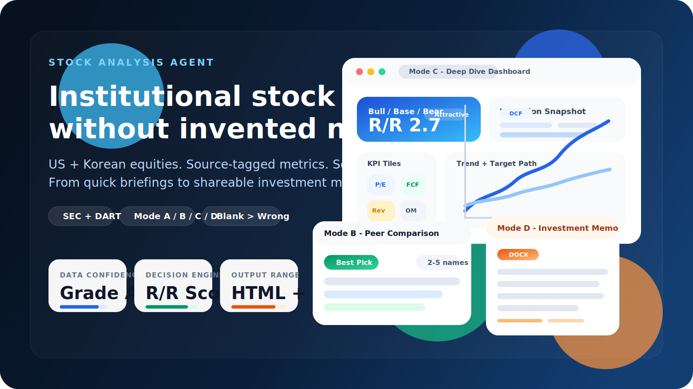
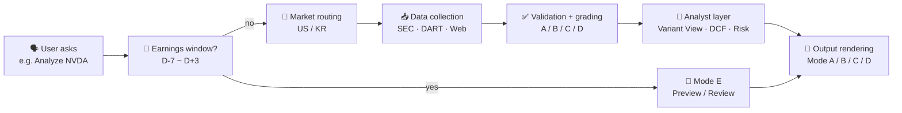

<div align="center">

# Stock Analysis Agent

### Institutional-grade research for US & Korean equities — without the invented numbers.

**Claude Code** orchestrates a full buy-side pipeline: SEC & DART filings first, every metric source-tagged, a confidence grade on every cell. From ticker to memo in minutes.

<sub>**English** · [한국어](README.ko.md)</sub>

<br/>


<br/>

<a href="https://codepen.io/lowtidebuild/full/xbEgpdE"></a>
<a href="https://codepen.io/lowtidebuild/full/emdgGdW"></a>
<a href="https://codepen.io/lowtidebuild/full/vEXgYGL"></a>
<a href="https://docs.google.com/document/d/1PX4FIrb1a4nBeKj3L7HanoYBfG6hSwOS/edit?usp=sharing&ouid=105178834220477378953&rtpof=true&sd=true"></a>

<sub><br/>Mode E preview pending — generated locally during the earnings window.</sub>

<br/><br/>



</div>

---

## What's new

**v2.1 (May 7, 2026)** — six shipped enhancements across the analysis stack:

- **Mode E (Earnings Preview/Review)** — new mode auto-detected in the D-7 ~ D+3 window around an earnings print. Preview covers consensus, beat/miss history, key questions, options-implied move, and pre-print position. Review covers actual vs consensus, guidance delta, key-questions answered, thesis impact, and post-print action.
- **Valuation Bridge (Mode C)** — a new section reconciles four anchors (DCF, Comps, Analyst Target, Our Base) into a single weighted fair value with the reconciliation logic shown.
- **Auto Delta Banner (all modes)** — when a prior snapshot exists, every report (A/B/C/D) prepends a banner showing R/R, target, and weighted-fair-value deltas plus risk/catalyst additions. Toggle off with `--no-delta`.
- **Mode B Macro Context** — peer comparisons now render 3–5 macro series with a per-peer narrative paragraph (light bundle, no Mode C-style sensitivity table).
- **Symmetric Peer Comparison (Mode C/D)** — peers fetched via an abbreviated yfinance pipeline (8 metrics, 24h cache) so peer cells are real Portal Grade B values instead of placeholder estimates.
- **Catalyst Timeline (Mode C)** — catalyst lists now render as Gantt-style horizontal bars across five categories (earnings, regulatory, product, macro, other), merged with peer catalysts where relevant.

---

## Why this exists

Most stock-research chatbots happily invent P/E ratios, hallucinate revenue, and cite sources that don't say what they claim. This agent is built on the opposite assumption.

> **Blank beats wrong.** If a figure cannot be verified against a primary source, it stays as `—`. No exceptions.

Five principles hold the system together:

| | Principle | What it means in practice |
|---|---|---|
| **1** | **Blank > Wrong** | Grade D values render as `—`. The model never fills a gap it cannot prove. |
| **2** | **No Source, No Number** | Every numerical claim carries a `[Filing]`, `[Portal]`, `[Calc]`… tag. |
| **3** | **Company-Specificity** | Variant views must fail the competitor-replacement test — generic analysis is worse than none. |
| **4** | **Adaptive Data** | Enhanced (MCP) when keys are live, Standard (web) when they aren't. Both ship. |
| **5** | **Mechanism Required** | Every risk has a causal chain: `event → P&L impact → stock price`. |

---

## What you get

Type a ticker. Get a buy-side note — not a chatbot summary.

<table>
  <tr>
    <td width="33%" valign="top" align="center">
      <h3>🇺🇸 US Stocks</h3>
      <strong>SEC-grade financials</strong><br/><br/>
      Financial Datasets API unlocks Grade A data: live price, 8-quarter statements, insider transactions, and filings — straight from the source of record.
    </td>
    <td width="33%" valign="top" align="center">
      <h3>🇰🇷 Korean Stocks</h3>
      <strong>DART-grade financials</strong><br/><br/>
      DART OpenAPI pulls regulator-filed statements directly. Naver Finance, FnGuide, and KIND layer on real-time market context.
    </td>
    <td width="33%" valign="top" align="center">
      <h3>🧠 Analysis Layer</h3>
      <strong>Buy-side discipline</strong><br/><br/>
      Scenario analysis, Variant View, precision risk, DCF + Reverse DCF (implied growth), peer comparison — every number shipped with a confidence grade and source tag.
    </td>
  </tr>
</table>

What lands in the report:

- 📊 **Scenario analysis** — Bull / Base / Bear with a probability-weighted `R/R Score`
- 🎯 **Variant View** — where the market is wrong, backed by company-specific evidence
- ⚠️ **Precision Risk** — event → P&L impact → stock price effect (no hand-waving)
- 🔖 **Source-tagged data** — every number traces back to its origin
- 🇰🇷 **Korean market overlay** — foreign ownership, value-up policies, disclosure flow

---

## Workflows

Built for research, not quote lookups. One natural-language prompt routes into the right workflow:

| Workflow | Use it for | Example prompt | Primary output |
|----------|------------|----------------|----------------|
| Single-stock analysis | default deep research on one ticker | `Analyze NVDA` | Mode C dashboard |
| Quick screen | a fast first pass before deeper work | `Analyze AAPL in Mode A` | Mode A briefing |
| Peer comparison | ranking 2-5 names under one framework | `NVDA vs AMD vs INTC` | Mode B comparison |
| Investment memo | a formal, shareable write-up | `AAPL investment memo` | Mode D DOCX |
| Earnings preview / review | the D-7 ~ D+3 window around an earnings print | `GOOGL earnings preview` / `AAPL Q1 review` | Mode E HTML |
| Watchlist / delta | monitoring what changed since the last run | `Scan my watchlist` / `Compare NVDA to the last analysis` | refreshed artifacts + delta context |

> Need just a quote? Use a market-data app. This repo is built for the work that comes *after* the price check.

---

## Output Modes

Not sure which to pick? Start with **Mode C** — it's the default full-analysis path.

<table>
  <tr>
    <th align="left">Mode</th>
    <th align="left">Choose This When</th>
    <th align="left">What You Get</th>
    <th align="left">Best For</th>
    <th align="left">Example</th>
  </tr>
  <tr>
    <td valign="top"><strong>A — Quick Briefing</strong><br/>Fastest pass</td>
    <td valign="top">You want a first screen before spending time on a full write-up.</td>
    <td valign="top">HTML verdict card<br/>180-day catalyst timeline<br/>3 KPI tiles</td>
    <td valign="top">Fast triage and go / no-go decisions</td>
    <td valign="top"><a href="https://codepen.io/lowtidebuild/full/xbEgpdE">Open example</a></td>
  </tr>
  <tr>
    <td valign="top"><strong>B — Peer Comparison</strong><br/>Relative ranking</td>
    <td valign="top">You need to compare 2-5 names under one consistent framework.</td>
    <td valign="top">HTML comparison matrix<br/>R/R ranking<br/>best-pick call</td>
    <td valign="top">Choosing the strongest name in a peer set</td>
    <td valign="top"><a href="https://codepen.io/lowtidebuild/full/emdgGdW">Open example</a></td>
  </tr>
  <tr>
    <td valign="top"><strong>C — Deep Dive Dashboard</strong><br/>Default mode</td>
    <td valign="top">You want the main investment case, valuation, risks, and strategy in one view.</td>
    <td valign="top">HTML dashboard<br/>KPIs, charts, valuation, macro, scenarios</td>
    <td valign="top">Day-to-day deep research</td>
    <td valign="top"><a href="https://codepen.io/lowtidebuild/full/vEXgYGL">Open example</a></td>
  </tr>
  <tr>
    <td valign="top"><strong>D — Investment Memo</strong><br/>Most formal</td>
    <td valign="top">You need a shareable long-form document for review, discussion, or archive.</td>
    <td valign="top">DOCX memo<br/>3,000+ word structured note<br/>full thesis + appendix</td>
    <td valign="top">Formal write-ups you can circulate</td>
    <td valign="top"><a href="https://docs.google.com/document/d/1PX4FIrb1a4nBeKj3L7HanoYBfG6hSwOS/edit?usp=sharing&ouid=105178834220477378953&rtpof=true&sd=true">Open example</a></td>
  </tr>
  <tr>
    <td valign="top"><strong>E — Earnings Preview / Review</strong><br/>Earnings window only</td>
    <td valign="top">You're in the D-7 ~ D+3 window around an earnings print and need a focused preview or review — not a full Mode C rerun.</td>
    <td valign="top">HTML preview or review<br/>consensus + key questions<br/>options-implied move (Preview)<br/>actual vs consensus + thesis impact (Review)</td>
    <td valign="top">Trading the print: pre-position before earnings or judge the print after</td>
    <td valign="top">Preview pending — generated locally</td>
  </tr>
</table>

<sub>Mode D opens as a Google Docs preview — GitHub does not render `.docx` inline.</sub>

<details>
<summary><strong>See the detailed structure for each mode</strong></summary>

### 🔍 Mode A — Quick Briefing
**A** as in **A**t-a-glance. A one-page HTML screen for fast triage. ~500 words, 2–3 minutes.

| Section | Contents |
|---------|----------|
| **One-Line Thesis** | single sentence — must pass the competitor replacement test |
| **Verdict Badge** | Overweight / Neutral / Underweight + R/R Score (color-coded) |
| **KPI Tiles** | 3 metrics chosen by company type (e.g. Tech: P/E · Revenue Growth · FCF Yield) |
| **Scenario Snapshot** | Bull / Base / Bear targets · probabilities · returns |
| **Event Timeline** | 180-day catalyst calendar — earnings · product launches · regulatory events |
| **Go-Deeper Prompt** | one-click upgrade to Mode C or Mode D |

### ⚖️ Mode B — Peer Comparison
**B** as in **B**enchmark. 2–5 tickers evaluated under one consistent frame. 800–1,200 words.

| Section | Contents |
|---------|----------|
| **Comparison Matrix** | valuation · growth · profitability · balance sheet — Winner column per row |
| **R/R Score Ranking** | weighted score per ticker, sorted best → worst |
| **Per-Ticker Variant View** | Q1 + Q2 short form — consensus disagreement + primary catalyst |
| **Best Pick** | reasoned recommendation · why this peer wins on risk-adjusted basis |
| **Relative Valuation** | premium / discount vs peer median with mechanism |
| **Macro Lens** *(new)* | 3–5 macro series rendered with a per-peer narrative paragraph (light bundle, no Mode C-style sensitivity table) |
| **Consistency Rule** | same metric set across all peers · missing → "—" (never substituted) |

### 📈 Mode C — Deep Dive Dashboard *(default)*
**C** as in **C**hart. An HTML dashboard designed for fast investment decision-making.

| Section | Contents |
|---------|----------|
| **Header** | Company name · live price · market cap · 52W range · IR / filing links |
| **Scenario Cards** | 🐂 Bull / 📊 Base / 🐻 Bear price targets · probabilities |
| **R/R Score Badge** | Weighted risk/reward score |
| **KPI Tiles** | P/E · EV/EBITDA · FCF Yield · Revenue Growth · Operating Margin |
| **Variant View** | Q1-Q3: where the market is wrong, with company-specific proof |
| **Precision Risk** | 3 risks × mechanism chain × EBITDA impact × mitigation |
| **Macro Environment** | macro factors · impact assessment · confidence badges |
| **Valuation** | SOTP · comps · **DCF sensitivity table + Reverse DCF (implied growth)** |
| **Valuation Bridge** *(new)* | 4 anchors (DCF · Comps · Analyst Target · Our Base) reconciled into a weighted fair value, with the reconciliation logic shown |
| **Peer Comparison** *(symmetric, new)* | peers fetched via abbreviated yfinance pipeline (8 metrics, 24h cache) — real Portal Grade B values instead of placeholder estimates |
| **Catalyst Timeline** *(new)* | Gantt-style horizontal bars across 5 categories (earnings · regulatory · product · macro · other), merged with peer catalysts |
| **Analyst Targets** | consensus · high/low · rating distribution |
| **Charts** | revenue trend · margin history · price vs targets |
| **Quarterly Financials** | 8-quarter income statement · QoE bridge |
| **Strategy** | positioning guide · key catalysts |

### 📝 Mode D — Investment Memo
**D** as in **D**ocument. A Word document for full write-ups and sharing.

| Section | Contents |
|---------|----------|
| Executive Summary | one-line thesis · verdict · R/R Score |
| Business Overview | revenue mix · market share · TAM |
| Financial Performance | 8-quarter tables · margin trends · FCF |
| Valuation | P/E · EV/EBITDA · SOTP · **DCF fair value + sensitivity + Reverse DCF** |
| **5-Question Variant View** | where the market is wrong |
| Precision Risk Analysis | 3 risks × full mechanism chain + EBITDA impact |
| Macro Risk Overlay | top-down factors · sector sensitivity · impact pathways |
| Investment Scenarios | Bull / Base / Bear with the R/R formula |
| Peer Comparison | 5 metrics vs. 3-5 peers |
| Management & Governance | CEO track record · capital allocation |
| Quality of Earnings | EBITDA bridge · FCF conversion · SBC haircut |
| What Would Make Me Wrong | 3 assumptions · pre-mortem |
| Appendix | data sources · confidence grades · exclusions |

### 📅 Mode E — Earnings Preview / Review
**E** as in **E**arnings. A focused report for the D-7 ~ D+3 window around an earnings print. Auto-detected by the earnings-window-detector skill; outside the window the agent falls back to Mode C. Override with `--earnings-mode preview|review` or `--mode E`.

Mode E is **not** Mode C plus a timeline — it has its own framework, sub-modes, and renderer. Outputs land at `output/reports/{TICKER}_E_{preview|review}_{lang}_{date}.html`.

**Preview (D-7 ~ D-1)** — six sections:

| Section | Contents |
|---------|----------|
| **Consensus Snapshot** | EPS · revenue consensus · key segment expectations |
| **Beat / Miss History** | last 8 quarters: actual vs consensus · surprise % · 1-day reaction |
| **Key Questions** | 3–5 specific questions the print needs to answer |
| **Options Snapshot** | ATM straddle · IV percentile · implied move % (best-effort via yfinance) |
| **Pre-Mortem** | what would invalidate the long / short going into the print |
| **Pre-Print Position** | sizing, hedges, and the explicit pre-print stance |

**Review (D ~ D+3)** — six sections:

| Section | Contents |
|---------|----------|
| **Print Snapshot** | actual vs consensus on EPS, revenue, segments |
| **Guidance Delta** | next-quarter / FY guidance vs prior expectation |
| **Key Questions Answered** | each Preview question marked answered / partial / unanswered with evidence |
| **Thesis Impact** | long & short pillars from the prior Mode C re-evaluated |
| **Light Verdict Update** | forward EPS only — DCF and price targets are carried forward with `outdated=true` and a Mode C rerun banner |
| **Post-Print Action** | concrete next move: add / trim / hold / flip with rationale |

> **Mode E rules**
> - Entry to Mode E forces `FRESH_COLLECTION` — a stale snapshot is never reused for an earnings print.
> - If options data is unavailable, Section 4 renders a stub with `[Quality flag]` rather than blocking the report.
> - The Review verdict is intentionally light: targets are not re-derived. The report flags itself `outdated=true` and recommends a full Mode C rerun.

</details>

> **Auto Delta Banner.** When a prior snapshot exists for the same ticker, every report (Mode A/B/C/D) prepends a banner with R/R, target, and weighted-fair-value deltas plus risk/catalyst additions. Disable with `--no-delta`.

---

## Research Pipeline



Five stages, no shortcuts:

1. **Interpret** the ticker and user intent.
2. **Route** to US (SEC) or Korean (DART) data collection.
3. **Validate** every metric and assign a confidence grade.
4. **Analyze** — valuation, risk, and differentiated insight.
5. **Render** HTML dashboard or DOCX memo.

---

## Data Confidence System

Confidence grades are **part of the product**, not a hidden implementation detail. A missing value is a deliberate signal, not a failure.

| Grade | Tag | Meaning | Example |
|-------|-----|---------|---------|
| **A** | `[Filing]` | primary regulatory filing source + arithmetic consistency | SEC / DART API |
| **A** | `[Macro]` | government / central bank statistics | FRED API |
| **B** | `[Company]` | company IR material, earnings release, transcript | company IR / newsroom |
| **B** | `[Portal]` / `[KR-Portal]` | 2+ sources cross-checked | web cross-reference |
| **B/C** | `[Portal]` | yfinance fallback; Grade B when cross-confirmed, Grade C when standalone | yfinance supplement |
| **B/C** | `[Options]` | options chain (Mode E Preview) — ATM straddle, IV percentile, implied move | yfinance option_chain |
| **B/C** | `[History]` | earnings history (Mode E Preview/Review) — last 8Q actual vs consensus, surprise %, 1d reaction | yfinance earnings_history |
| **C** | `Grade C` | single-source, unverified | one web mention |
| **D** | `—` | cannot verify → shown as blank | never fabricated |

```text
US example:
  Revenue TTM: $402.8B [Filing]
  P/E Ratio: 28.0x [Calc]
  EV/EBITDA: —

Korean example:
  Revenue TTM: 302.2T KRW [Filing]
  Operating Margin: 9.2% [Calc]
  Consensus PER: 12.4x [KR-Portal]
```

---

## R/R Score — one number, honest math

Every analysis reduces scenario-weighted upside versus downside into a single headline number.

```text
R/R Score = (Bull_return% × Bull_prob + Base_return% × Base_prob)
            ─────────────────────────────────────────────────────
                       |Bear_return% × Bear_prob|
```

| Score | Signal | Typical Verdict |
|-------|--------|-----------------|
| **> 3.0** | 🟢 Attractive | Overweight |
| **1.0 – 3.0** | 🟡 Neutral | Neutral / Watch |
| **< 1.0** | 🔴 Unfavorable | Underweight |

---

## Quick Start

### Prerequisites

- **Claude Code** installed locally
- **Python 3.8+** for helper scripts
- **`python-docx`** for Mode D DOCX output
- **`yfinance`** options-chain access for Mode E Preview (best-effort — Mode E gracefully renders a stub if the chain is unavailable)

### Setup path — pick what you need

| Goal | Configure | Why it matters |
|------|-----------|----------------|
| 🇺🇸 Best US coverage | Financial Datasets MCP | SEC-based structured financials, real-time price, insider trades |
| 🔄 Middle fallback | yfinance | Stable Python fallback for price/basics — no API key, used before raw web scraping |
| 📊 Macro precision (Mode C/D) | `FRED_API_KEY` | Treasury, Fed, CPI, GDP, unemployment |
| 🇰🇷 Korean stocks | `DART_API_KEY` | Regulator financials and recent disclosures |

### 1. Install the basics

```bash
npm install -g @anthropic-ai/claude-code
pip install -r requirements.txt
git clone https://github.com/lowtidebuild/stock-analysis-agent.git
cd stock-analysis-agent
cp .env.example .env
```

`requirements.txt` installs the shared helper-script dependencies, including `python-docx` and `yfinance`.

`cp .env.example .env` gives you a convenient place to store optional local keys such as `FRED_API_KEY`.

### 2. Connect Grade A US data *(strongly recommended)*

```bash
claude mcp add --transport http financial-datasets https://mcp.financialdatasets.ai/ \
  --header "X-API-KEY: your_api_key_here"
```

Get a key at [financialdatasets.ai](https://financialdatasets.ai)  
Setup guide: [docs/mcp-setup-guide.md](docs/mcp-setup-guide.md)

### 3. Connect FRED API *(optional, for macro precision in Mode C/D)*

Add to `.env`:

```bash
FRED_API_KEY=your_key_here
```

This adds Grade A macro inputs such as the 10Y Treasury, Fed Funds Rate, CPI, GDP, and unemployment.

### 4. Connect DART API *(free and effectively required for Korean stocks)*

Add to the `env` block in `.claude/settings.local.json`:

```json
"env": { "DART_API_KEY": "your_key_here" }
```

Get a key at [opendart.fss.or.kr](https://opendart.fss.or.kr)

If you prefer project-local secrets over shell variables, keep them together in this same `env` block.

### 5. Run

```bash
claude
```

`CLAUDE.md` is loaded automatically at startup, and the session will show a state block like:

```text
=== Stock Analysis Agent ===
Data Mode (US):  {Enhanced (MCP active) / Standard (yfinance + Web)}
Data Mode (KR):  DART API (Grade A financials) + Naver Finance (price) + yfinance fallback
Date: {YYYY-MM-DD}
Ready. Send a ticker or question to begin.
```

---

## Common Prompts

| Goal | Example prompt |
|------|----------------|
| Default deep dive | `Analyze NVDA` |
| Korean single-stock analysis | `005930 심층 분석` |
| Formal memo | `AAPL investment memo` / `삼성전자 투자 메모 써줘` |
| Peer comparison | `NVDA vs AMD vs INTC` / `삼성전자 vs SK하이닉스 비교` |
| Earnings preview (D-7 ~ D-1) | `GOOGL 프리뷰` / `earnings preview AAPL` / `Q1 preview NVDA` |
| Earnings review (D ~ D+3) | `AAPL Q1 review` / `MSFT 실적 리뷰` / `earnings review TSLA` |
| Force Mode E outside the auto window | append `--mode E` or `--earnings-mode preview\|review` |
| Watchlist scan | `Scan my watchlist` |
| Delta comparison | `Compare NVDA to the last analysis` |

Price-only queries are not supported. Ask for analysis instead, such as `Analyze AAPL` or `삼성전자 분석해줘`.

---

## Generated Artifacts

Each run leaves both a human-readable report and machine-readable checkpoints. That makes it easy to inspect validation, compare against the previous snapshot, or automate follow-up workflows.

| Path family | What it stores |
|-------------|----------------|
| `output/reports/` | final HTML / DOCX deliverables |
| `output/runs/{run_id}/{ticker}/` | run-local research plan, validated data, analysis result, QA report |
| `output/data/{ticker}/` | reusable snapshots for delta analysis and watchlist refreshes |

---

<details>
<summary><strong>See detailed data sources — US stocks</strong></summary>

> **Strongly recommended.** Connecting [Financial Datasets API](https://financialdatasets.ai) unlocks Grade A data collection.

Structured data pulled directly from SEC filings:

| Data | API Call | Confidence |
|------|----------|------------|
| Real-time price | `get_current_stock_price` | Grade A |
| 8-quarter income statement | `get_income_statements` | Grade A |
| Balance sheet (8 quarters) | `get_balance_sheets` | Grade A |
| Cash flow (8 quarters) | `get_cash_flow_statements` | Grade A |
| Analyst price targets | FMP MCP | Grade B |
| Insider transactions | `get_insider_transactions` | Grade A |
| SEC filings (10-K, 10-Q) | `get_sec_filings` | Grade A |

Major fallbacks used alongside or without MCP:

| Data | Source | Confidence |
|------|--------|------------|
| Price · Market cap · basic ratios fallback | yfinance | Grade B/C |
| Price · Market cap · Ratios | Yahoo Finance, Google Finance, MarketWatch | Grade B |
| Financial statements | SEC EDGAR (direct fetch) | Grade A |
| Earnings results | PR Newswire, Business Wire, Seeking Alpha | Grade B |
| Analyst price targets | TipRanks, MarketBeat | Grade B |
| News · Qualitative context | Reuters, Bloomberg, CNBC, Financial Times | Qualitative |
| Insider trading | SEC Form 4 (EDGAR), Finviz | Grade B |

When Financial Datasets MCP is unavailable, Standard Mode tries yfinance first and only then falls back to direct web search / scraping.

</details>

<details>
<summary><strong>See detailed data sources — Korean stocks</strong></summary>

Korean stocks always pull structured financial statements directly from **DART OpenAPI**.

| Data | Source | Confidence |
|------|--------|------------|
| Consolidated financials (IS/BS/CF) | DART OpenAPI `fnlttSinglAcntAll` | Grade A |
| Company metadata (corp_code, CEO) | DART OpenAPI `company` | Grade A |
| Recent disclosures (90 days) | DART OpenAPI `list` | Grade A |
| Price · PER · PBR · foreign ownership | Naver Finance | Grade B |
| Fallback price · PER · PBR · EPS · 52W range | yfinance (`.KS` / `.KQ`) | Grade B/C |
| Analyst consensus | FnGuide / web research | Grade B |

Naver Finance remains the primary KR market-data source; yfinance only fills gaps if the Naver fetch fails or required fields are missing.

The Korean workflow combines DART financials with Naver Finance market data, yfinance fallback coverage, and FnGuide / KIND context.

</details>

<details>
<summary><strong>See outputs, file paths, and mode comparison</strong></summary>

All generated files live under `output/`.

| File | Purpose |
|------|---------|
| `output/runs/{run_id}/{ticker}/research-plan.json` | run-local research plan |
| `output/runs/{run_id}/{ticker}/validated-data.json` | run-local validated data |
| `output/runs/{run_id}/{ticker}/analysis-result.json` | run-local structured analysis |
| `output/runs/{run_id}/{ticker}/quality-report.json` | run-local QA report |
| `output/reports/{ticker}_A_*.html` | Mode A quick briefing |
| `output/reports/{tickers}_B_*.html` | Mode B peer comparison |
| `output/reports/{ticker}_C_*.html` | Mode C dashboard |
| `output/reports/{ticker}_D_*.docx` | Mode D investment memo |
| `output/reports/{ticker}_E_{preview\|review}_*.html` | Mode E earnings preview / review |
| `output/data/{ticker}/latest.json` | snapshot pointer for delta analysis |
| `output/watchlist.json` | watchlist registry |
| `output/catalyst-calendar.json` | catalyst calendar |

US stocks operate in two modes depending on whether Financial Datasets API is connected:

| | Enhanced Mode 🟢 | Standard Mode 🟡 |
|-|-----------------|-----------------|
| **Requires** | Financial Datasets API key | No API key; yfinance first, web search if needed |
| **Data source** | structured SEC API | yfinance + web research |
| **Price data** | real-time, Grade A | yfinance / web-sourced, Grade B/C |
| **Financials** | 8 quarters, machine-readable | yfinance statements + web fallback, may vary |
| **Max grade** | **Grade A** | Grade B |
| **Cost** | ~$0.05-$0.28 per analysis | Free |

</details>

<details>
<summary><strong>See the project structure</strong></summary>

```text
stock-analysis-agent/
├── CLAUDE.md
├── README.md
├── README.ko.md
├── docs/
│   ├── assets/
│   ├── mcp-setup-guide.md
│   └── mcp-setup-guide.ko.md
├── references/
├── output/
│   ├── reports/
│   └── data/
├── evals/
├── tools/
└── .claude/
    ├── skills/
    └── agents/
```

</details>

---

## Disclaimer

**This tool is for informational purposes only. It is not investment advice, a solicitation to buy or sell securities, or a guarantee of returns.**

- All analysis is AI-generated and may contain errors.
- Verify time-sensitive data with primary sources before acting.
- Past performance does not predict future results.
- Consult a qualified financial professional before making investment decisions.

The anti-hallucination system reduces but does not eliminate data risk. Independently verify all outputs before acting on them.
