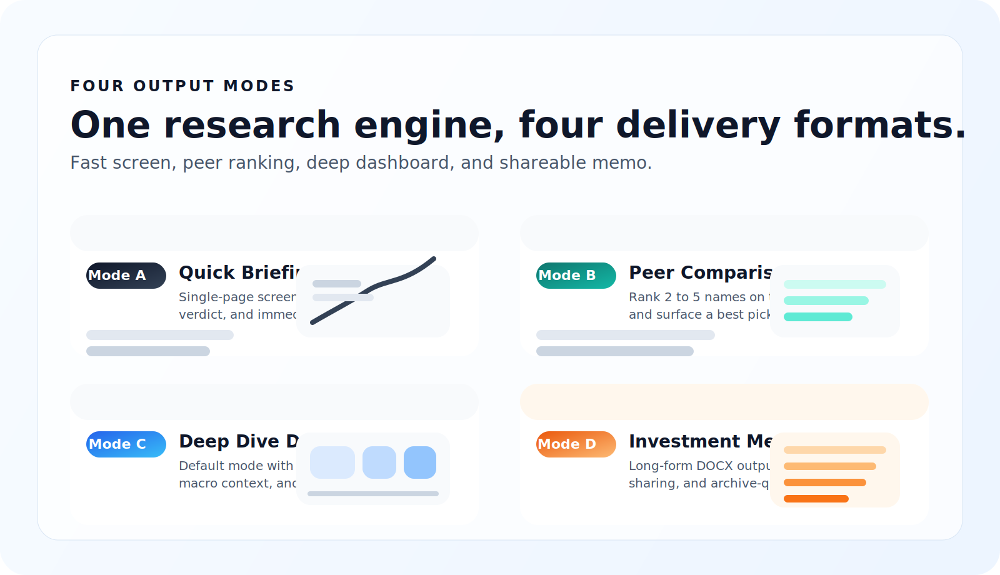
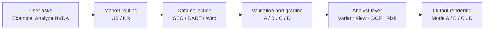

<div align="center">
  <h1>Stock Analysis Agent</h1>
  <p><strong>Institutional-grade research for US and Korean equities</strong></p>
  <p>Built on Claude Code. Grade A data first. Every number is source-tagged. Full research output in minutes.</p>
  <p>English · <a href="README.ko.md">한국어</a></p>
</div>

<p align="center">
  
  
  
  
</p>

<p align="center">
  <a href="https://codepen.io/lowtidebuild/full/xbEgpdE"></a>
  <a href="https://codepen.io/lowtidebuild/full/emdgGdW"></a>
  <a href="https://codepen.io/lowtidebuild/full/vEXgYGL"></a>
  <a href="https://docs.google.com/document/d/1PX4FIrb1a4nBeKj3L7HanoYBfG6hSwOS/edit?usp=sharing&ouid=105178834220477378953&rtpof=true&sd=true"></a>
</p>

> **Core principle**: Blank beats wrong. If a figure cannot be verified, it stays as `"—"` instead of being invented.

<p align="center">
  
</p>

---

## At A Glance

<table>
  <tr>
    <td width="33%" valign="top">
      <strong>🇺🇸 US Stocks</strong><br/>
      Financial Datasets API unlocks SEC-based Grade A financial data<br/><br/>
      Live price, 8-quarter financials, insider transactions, and filings in one flow
    </td>
    <td width="33%" valign="top">
      <strong>🇰🇷 Korean Stocks</strong><br/>
      DART OpenAPI pulls structured financials directly from the regulator<br/><br/>
      Naver Finance, FnGuide, and KIND enrich the market context
    </td>
    <td width="33%" valign="top">
      <strong>🧠 Analysis Layer</strong><br/>
      Scenario analysis, Variant View, precision risk, DCF, and peer comparison<br/><br/>
      Every number ships with confidence grades and source tags
    </td>
  </tr>
</table>

Type a ticker and the agent produces research that feels closer to a buy-side note than a chatbot summary.

- **Scenario analysis**: Bull / Base / Bear with a probability-weighted `R/R Score`
- **Variant View**: where the market is wrong, backed by company-specific evidence
- **Precision Risk Analysis**: event → P&L impact → stock price effect
- **Source-tagged data**: every number traces back to an origin
- **Korean market overlay**: foreign ownership, value-up policies, disclosure flow

---

## Output Modes

<p align="center">
  
</p>

| Mode | Format | Best for | Output |
|------|--------|----------|--------|
| **A — Quick Briefing** | HTML | fast screening | verdict card + 180-day event timeline |
| **B — Peer Comparison** | HTML | comparing 2-5 tickers | side-by-side matrix + ranking + best pick |
| **C — Deep Dive Dashboard** | HTML | default deep research | KPIs, valuation, charts, risks, macro, scenarios |
| **D — Investment Memo** | DOCX | formal shareable memo | 3,000+ words in a structured research note |

<details>
<summary><strong>See the detailed structure for each mode</strong></summary>

### 🔍 Mode A — Quick Briefing
**A** as in **A**t-a-glance. A one-page screen for fast triage.

### ⚖️ Mode B — Peer Comparison
**B** as in **B**enchmark. Built for 2-5 tickers under one evaluation frame.

### 📈 Mode C — Deep Dive Dashboard *(default)*
**C** as in **C**hart. An HTML dashboard designed for fast investment decision-making.

| Section | Contents |
|---------|----------|
| **Header** | Company name · live price · market cap · 52W range · IR / filing links |
| **Scenario Cards** | 🐂 Bull / 📊 Base / 🐻 Bear price targets · probabilities |
| **R/R Score Badge** | Weighted risk/reward score |
| **KPI Tiles** | P/E · EV/EBITDA · FCF Yield · Revenue Growth · Operating Margin |
| **Variant View** | Q1-Q3: where the market is wrong, with company-specific proof |
| **Precision Risk** | 3 risks × mechanism chain × EBITDA impact × mitigation |
| **Macro Environment** | macro factors · impact assessment · confidence badges |
| **Valuation** | SOTP · comps · **DCF sensitivity table** |
| **Analyst Targets** | consensus · high/low · rating distribution |
| **Charts** | revenue trend · margin history · price vs targets |
| **Quarterly Financials** | 8-quarter income statement · QoE bridge |
| **Strategy** | positioning guide · key catalysts |

### 📝 Mode D — Investment Memo
**D** as in **D**ocument. A Word document for full write-ups and sharing.

| Section | Contents |
|---------|----------|
| Executive Summary | one-line thesis · verdict · R/R Score |
| Business Overview | revenue mix · market share · TAM |
| Financial Performance | 8-quarter tables · margin trends · FCF |
| Valuation | P/E · EV/EBITDA · SOTP · **DCF fair value + sensitivity** |
| **5-Question Variant View** | where the market is wrong |
| Precision Risk Analysis | 3 risks × full mechanism chain + EBITDA impact |
| Macro Risk Overlay | top-down factors · sector sensitivity · impact pathways |
| Investment Scenarios | Bull / Base / Bear with the R/R formula |
| Peer Comparison | 5 metrics vs. 3-5 peers |
| Management & Governance | CEO track record · capital allocation |
| Quality of Earnings | EBITDA bridge · FCF conversion · SBC haircut |
| What Would Make Me Wrong | 3 assumptions · pre-mortem |
| Appendix | data sources · confidence grades · exclusions |

</details>

---

## Research Pipeline



The pipeline is straightforward:

1. Interpret the ticker and intent.
2. Route to US or Korean data collection.
3. Validate and grade each metric.
4. Generate valuation, risk, and differentiated insight.
5. Render HTML or DOCX outputs.

---

## Data Confidence System

| Grade | Tag | Meaning | Example |
|-------|-----|---------|---------|
| **A** | `[Filing]` | primary regulatory filing source + arithmetic consistency | SEC / DART API |
| **A** | `[Macro]` | government / central bank statistics | FRED API |
| **B** | `[Company]` | company IR material, earnings release, transcript | company IR / newsroom |
| **B** | `[Portal]` / `[KR-Portal]` | 2+ sources cross-checked | web cross-reference |
| **C** | `Grade C` | single-source, unverified | one web mention |
| **D** | `—` | cannot verify → shown as blank | never fabricated |

```text
US example:
  Revenue TTM: $402.8B [Filing]
  P/E Ratio: 28.0x [Calc]
  EV/EBITDA: —

Korean example:
  Revenue TTM: 302.2T KRW [Filing]
  Operating Margin: 9.2% [Calc]
  Consensus PER: 12.4x [KR-Portal]
```

---

## R/R Score

Every analysis reduces scenario-weighted upside versus downside into a single number.

```text
R/R Score = (Bull_return% × Bull_prob + Base_return% × Base_prob)
            ─────────────────────────────────────────────────────
                       |Bear_return% × Bear_prob|
```

| Score | Signal | Typical Verdict |
|-------|--------|-----------------|
| **> 3.0** | 🟢 Attractive | Overweight |
| **1.0 – 3.0** | 🟡 Neutral | Neutral / Watch |
| **< 1.0** | 🔴 Unfavorable | Underweight |

---

## Quick Start

### 1. Install the basics

```bash
npm install -g @anthropic-ai/claude-code
pip install python-docx
git clone https://github.com/lowtidebuild/stock-analysis-agent.git
cd stock-analysis-agent
```

### 2. Connect Grade A US data *(strongly recommended)*

```bash
claude mcp add --transport http financial-datasets https://mcp.financialdatasets.ai/ \
  --header "X-API-KEY: your_api_key_here"
```

Get a key at [financialdatasets.ai](https://financialdatasets.ai)  
Setup guide: [docs/mcp-setup-guide.md](docs/mcp-setup-guide.md)

### 3. Connect FRED API *(optional, for macro precision in Mode C/D)*

Add to `.env`:

```bash
FRED_API_KEY=your_key_here
```

This adds Grade A macro inputs such as the 10Y Treasury, Fed Funds Rate, CPI, GDP, and unemployment.

### 4. Connect DART API *(free and effectively required for Korean stocks)*

Add to `.claude/settings.local.json`:

```json
"env": { "DART_API_KEY": "your_key_here" }
```

Get a key at [opendart.fss.or.kr](https://opendart.fss.or.kr)

### 5. Run

```bash
claude
```

`CLAUDE.md` is loaded automatically at startup, and the session will show a state block like:

```text
=== Stock Analysis Agent ===
Data Mode (US):  {Enhanced (MCP active) / Standard (Web-only)}
Data Mode (KR):  DART-Enhanced (Grade A)
Date: {YYYY-MM-DD}
Ready. Send a ticker or question to begin.
```

---

## Common Prompts

```text
Analyze NVDA
005930 심층 분석
AAPL investment memo
삼성전자 투자 메모 써줘
NVDA vs AMD vs INTC
삼성전자 vs SK하이닉스 비교
Scan my watchlist
Compare NVDA to the last analysis
```

Price-only queries are not supported. Ask for analysis instead, such as `"Analyze AAPL"` or `"삼성전자 분석해줘"`.

---

<details>
<summary><strong>See detailed data sources — US stocks</strong></summary>

> **Strongly recommended.** Connecting [Financial Datasets API](https://financialdatasets.ai) unlocks Grade A data collection.

Structured data pulled directly from SEC filings:

| Data | API Call | Confidence |
|------|----------|------------|
| Real-time price | `get_current_stock_price` | Grade A |
| 8-quarter income statement | `get_income_statements` | Grade A |
| Balance sheet (8 quarters) | `get_balance_sheets` | Grade A |
| Cash flow (8 quarters) | `get_cash_flow_statements` | Grade A |
| Analyst price targets | FMP MCP | Grade B |
| Insider transactions | `get_insider_transactions` | Grade A |
| SEC filings (10-K, 10-Q) | `get_sec_filings` | Grade A |

Major web sources used alongside or without MCP:

| Data | Source | Confidence |
|------|--------|------------|
| Price · Market cap · Ratios | Yahoo Finance, Google Finance, MarketWatch | Grade B |
| Financial statements | SEC EDGAR (direct fetch) | Grade A |
| Earnings results | PR Newswire, Business Wire, Seeking Alpha | Grade B |
| Analyst price targets | TipRanks, MarketBeat | Grade B |
| News · Qualitative context | Reuters, Bloomberg, CNBC, Financial Times | Qualitative |
| Insider trading | SEC Form 4 (EDGAR), Finviz | Grade B |

</details>

<details>
<summary><strong>See detailed data sources — Korean stocks</strong></summary>

Korean stocks always pull structured financial statements directly from **DART OpenAPI**.

| Data | Source | Confidence |
|------|--------|------------|
| Consolidated financials (IS/BS/CF) | DART OpenAPI `fnlttSinglAcntAll` | Grade A |
| Company metadata (corp_code, CEO) | DART OpenAPI `company` | Grade A |
| Recent disclosures (90 days) | DART OpenAPI `list` | Grade A |
| Price · PER · PBR · foreign ownership | Naver Finance | Grade B |
| Analyst consensus | FnGuide / web research | Grade B |

The Korean workflow combines DART financials with Naver Finance market data and FnGuide / KIND context.

</details>

<details>
<summary><strong>See outputs, file paths, and mode comparison</strong></summary>

All generated files live under `output/`.

| File | Purpose |
|------|---------|
| `output/runs/{run_id}/{ticker}/research-plan.json` | run-local research plan |
| `output/runs/{run_id}/{ticker}/validated-data.json` | run-local validated data |
| `output/runs/{run_id}/{ticker}/analysis-result.json` | run-local structured analysis |
| `output/runs/{run_id}/{ticker}/quality-report.json` | run-local QA report |
| `output/reports/{ticker}_A_*.html` | Mode A quick briefing |
| `output/reports/{tickers}_B_*.html` | Mode B peer comparison |
| `output/reports/{ticker}_C_*.html` | Mode C dashboard |
| `output/reports/{ticker}_D_*.docx` | Mode D investment memo |
| `output/data/{ticker}/latest.json` | snapshot pointer for delta analysis |
| `output/watchlist.json` | watchlist registry |
| `output/catalyst-calendar.json` | catalyst calendar |

US stocks operate in two modes depending on whether Financial Datasets API is connected:

| | Enhanced Mode 🟢 | Standard Mode 🟡 |
|-|-----------------|-----------------|
| **Requires** | Financial Datasets API key | Nothing extra |
| **Data source** | structured SEC API | web research + scraping |
| **Price data** | real-time, Grade A | web-sourced, Grade B |
| **Financials** | 8 quarters, machine-readable | web-scraped, may vary |
| **Max grade** | **Grade A** | Grade B |
| **Cost** | ~$0.05-$0.28 per analysis | Free |

</details>

<details>
<summary><strong>See the project structure</strong></summary>

```text
stock-analysis-agent/
├── CLAUDE.md
├── README.md
├── README.ko.md
├── docs/
│   ├── assets/
│   ├── mcp-setup-guide.md
│   └── mcp-setup-guide.ko.md
├── references/
├── output/
│   ├── reports/
│   └── data/
├── evals/
├── tools/
└── .claude/
    ├── skills/
    └── agents/
```

</details>

---

## Disclaimer

**This tool is for informational purposes only. It is not investment advice, a solicitation to buy or sell securities, or a guarantee of returns.**

- All analysis is AI-generated and may contain errors.
- Verify time-sensitive data with primary sources before acting.
- Past performance does not predict future results.
- Consult a qualified financial professional before making investment decisions.

The anti-hallucination system reduces but does not eliminate data risk. Independently verify all outputs before acting on them.
